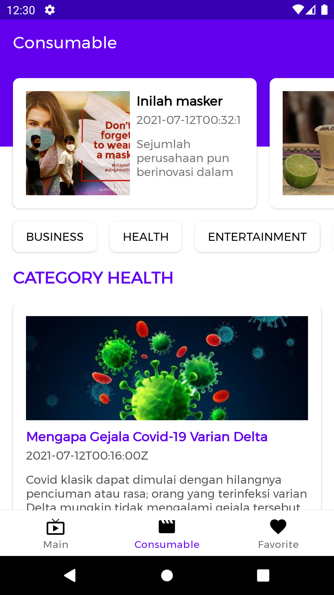
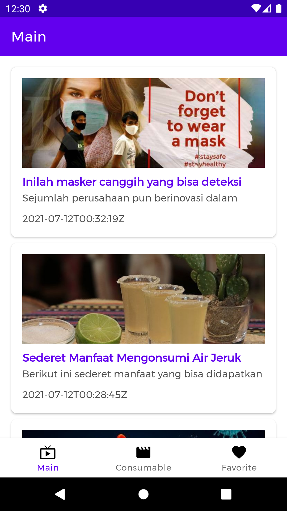

## About This Project

- Privacy Policy [Click Here](https://github.com/frogobox/frogo-kick-start-android/blob/master/PRIVACY-POLICY.md)
- License [Click Here](https://github.com/frogobox/frogo-kick-start-android/blob/master/LICENSE)
- Template Reuse Code For Monetizing Apps
- Template Code Monetize Frogobox For Android Kick Start Project

## Version Release
This Is Latest Release (Still Being Developed)

    $version_release = 1.0.0

## Screenshoot Apps
|                             UI 1                             |                             UI 2                             |                             UI 3                             |
|:------------------------------------------------------------:|:------------------------------------------------------------:|:------------------------------------------------------------:|
|  |  |  |

## Architecture
-   Pattern  [Model-View-ViewModel](https://en.wikipedia.org/wiki/Model%E2%80%93view%E2%80%93viewmodel)  (MVVM) facilitating a [separation](https://en.wikipedia.org/wiki/Separation_of_concerns) of development of the graphical user interface.
-   [S.O.L.I.D](https://en.wikipedia.org/wiki/SOLID)  design principles intended to make software designs more understandable, flexible and maintainable.

## Tech-stack
Min API level is set to 21, so the presented approach is suitable for over 94% of devices running Android. This project takes advantage of many popular libraries and tools of the Android ecosystem. Most of the libraries are in the stable version unless there is a good reason to use non-stable dependency.
-   [Jetpack](https://developer.android.com/jetpack):
    -   [Android KTX](https://developer.android.com/kotlin/ktx.html)  - provide concise, idiomatic Kotlin to Jetpack and Android platform APIs.
    -   [AndroidX](https://developer.android.com/jetpack/androidx)  - major improvement to the original Android  [Support Library](https://developer.android.com/topic/libraries/support-library/index), which is no longer maintained.
    -   [View Binding](https://developer.android.com/topic/libraries/view-binding)  - allows you to more easily write code that interacts with views/
    -   [Lifecycle](https://developer.android.com/topic/libraries/architecture/lifecycle)  - perform actions in response to a change in the lifecycle status of another component, such as activities and fragments.
    -   [LiveData](https://developer.android.com/topic/libraries/architecture/livedata)  - lifecycle-aware, meaning it respects the lifecycle of other app components, such as activities, fragments, or services.
    -   [Navigation](https://developer.android.com/guide/navigation/)  - helps you implement navigation, from simple button clicks to more complex patterns, such as app bars and the navigation drawer.
    -   [Room](https://developer.android.com/topic/libraries/architecture/room)  - persistence library provides an abstraction layer over SQLite to allow for more robust database access while harnessing the full power of SQLite.
    -   [ViewModel](https://developer.android.com/topic/libraries/architecture/viewmodel)  - designed to store and manage UI-related data in a lifecycle conscious way. The ViewModel class allows data to survive configuration changes such as screen rotations.
-   [Coroutines](https://kotlinlang.org/docs/reference/coroutines-overview.html)  - managing background threads with simplified code and reducing needs for callbacks.
-   [Coroutines Flow](https://kotlinlang.org/docs/reference/coroutines-overview.html)  - cold asynchronous data stream that sequentially emits values and completes normally or with an exception
-   [Hilt](https://dagger.dev/)  - dependency injector for replacement all Factory classes.
-   [Retrofit](https://square.github.io/retrofit/)  - type-safe HTTP client.
-   [Glide](https://github.com/bumptech/glide)  - image loading and caching library

## Colaborator
Very open to anyone, I'll write your name under this, please contribute by sending an email to me

- Mail To faisalamircs@gmail.com
- Subject : Github _ [Github-Username-Account] _ [Language] _ [Repository-Name]
- Example : Github_amirisback_kotlin_admob-helper-implementation

Name Of Contribute
- Muhammad Faisal Amir
- Waiting List
- Waiting List

Waiting for your contribute

## Attention !!!
Please enjoy and don't forget fork and give a star
- Don't Forget Follow My Github Account

